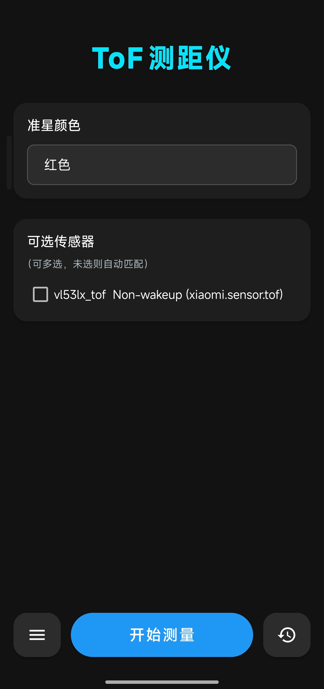
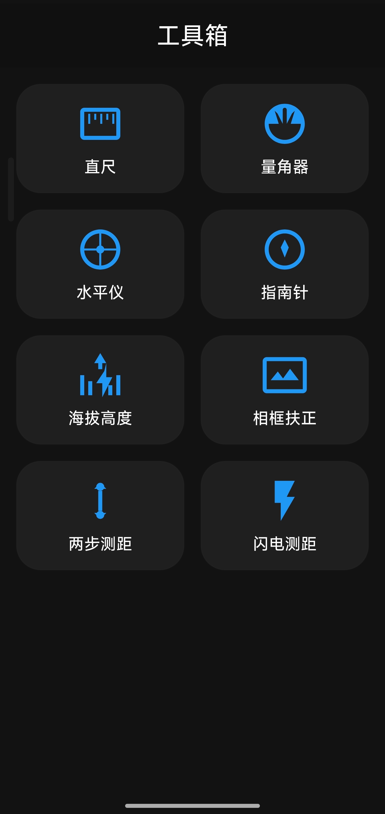

# ToF测距仪 (ToF Rangefinder) [English](README_EN.md)

简洁实用的手机测量工具集。核心功能基于 **Time-of-Flight (ToF)** 传感器提供快速、直观的距离测量，不依赖庞大的AR组件。同时内置多款实用生活测量工具。

## 📸 应用截图
<div align="center">
  
  
</div>

## 🎯 核心功能：ToF 测距
直接调用手机的激光对焦/ToF传感器获取原始距离数据，适合快速测量短距离物体（如身高、家具尺寸、间距等）。

- **原生数据**：直接显示传感器返回的毫米级整数值，无算法平滑延迟。
- **辅助显示**：
    - **准星调整**：支持拖拽准星选择测量点，或锁定中心。
    - **定格画面**：一键暂停（冻结画面与数据），方便在难以直视屏幕的角落测量后读取数据。
    - **倒计时测量**：设置延时自动锁定数据，单人操作更轻松。

## 🛠️ 实用工具箱
除ToF测距外，通过侧边栏可快速切换至多种生活测量小工具：

- **⚡ 闪电测距 (Lightning Distance)**  
  利用光速与音速差，通过检测闪电闪光和雷声波峰的时间差，估算雷暴距离。
- **📐 两步测高 (Two-Step Height)**  
  基于三角函数原理，分别瞄准物体底部和顶部，输入握持高度即可计算远处的物体高度。
- **📏 直尺 (Ruler)**  
  屏幕刻度尺，支持校准，用于测量微小物件。
- **🔄 量角器 (Protractor)**  
  通过相机透视或屏幕触控测量物体角度。
- **⚖️ 水平仪 (Bubble Level)**  
  检测平面是否水平或垂直。
- **🖼️ 挂画辅助 (Frame Alignment)**  
  利用相机预览与重力感应，辅助悬挂画框照片，保持水平。
- **🧭 指南针 (Compass)**  
  极简指南针，融合加速度计与磁力计数据，精准显示实时方位与磁场强度。
- **🏔️ 海拔表 (Altimeter)**  
  双模式测量：支持气压传感器获取相对海拔（含沸点估算），或使用GPS获取绝对海拔与经纬度坐标。
- **🎈 气密检测 (Airtightness Check)**  
  利用气压传感器监测手机内部气压变化，辅助检测手机防水密封性能。
- **📡 NFC读写 (NFC Reader/Writer)**  
  支持读取和写入NFC标签（NDEF格式），包括文本、网址、应用启动、WiFi/蓝牙配对、联系人及地理位置信息等。

## 📲 使用说明
1. **硬件要求**：ToF测距功能需要手机硬件支持ToF/激光对焦传感器。其他工具主要依赖加速度计、磁力计和麦克风。
2. **量程提示**：ToF传感器的有效量程通常在 **1cm ~ 5m** 之间（具体取决于机型），超出范围可能显示无效值。

## 🔨 构建与安装
项目基于标准 Android Gradle 构建：

- **构建 APK**：
  ```shell
  .\gradlew.bat clean assembleDebug
  ```
- **安装调试**：
  ```shell
  adb install -r app\build\outputs\apk\debug\app-debug.apk
  ```
